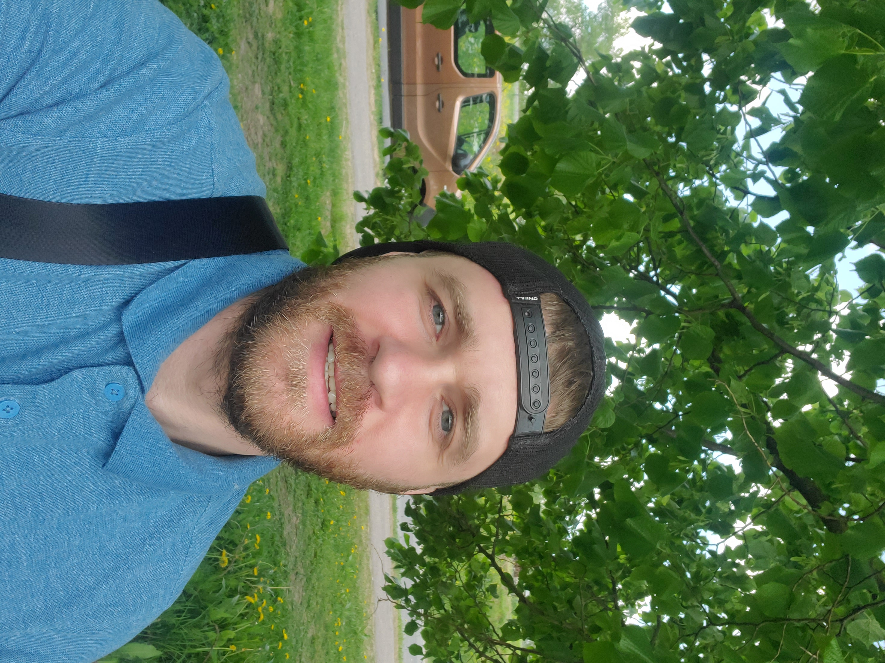

<table>
  <tr>
    <td>
      <h2>Name: <em>Pavel Ivanov</em></h2>
      <h2>Address: <em>Estonia, Tallinn</em></h2>
      <h2>Phone: <em>+372 58405552</em></h2>
      <h2>Email: <em>ivanagasaki00@gmail.com</em></h2>
      <h2>www: <a href="https://github.com/Siil777">github</a></h2>
    </td>
    <td style="text-align:right;">
      
    </td>
  </tr>
</table>

### Language skills
* English B2 level
* Estonian B2 level

### Education
**Tallinn Industrial Education Center**,*Junior Software Developer Diploma, EQF certificate level 4*

## Experience in IT field of activity
*I had practice for half a year in prospect small company CubixLab OÜ which engaged with web app development, participated in a real project, as well I continue to practice in this company.*

### Purpose of education
*Repeat basic stuff and pin study material, delve into the study of javascript*

### About me
*Higher and secondary education can include many languages and tools like python, C#, vba, google scripts, javascript, c++, php at the same time. On the one hand to have many languages of programming for short period of time it is a good way to look around and broaden mind, on the other, as rule it is not enough to become a specialist in some one.*

### Skills
* HTML
* CSS
* Javascript (basic)
* SQL server
* XAMPP

### Code example
```
var previousButton = document.getElementById('hp-previous');
if (previousButton!== null){
        previousButton.addEventListener('click', function(){
            showPreviousQuestion();
            updateCircleColor();
        });
}
```


